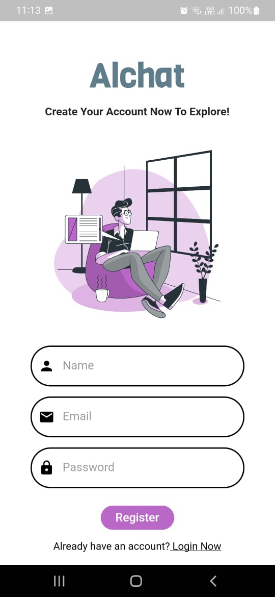
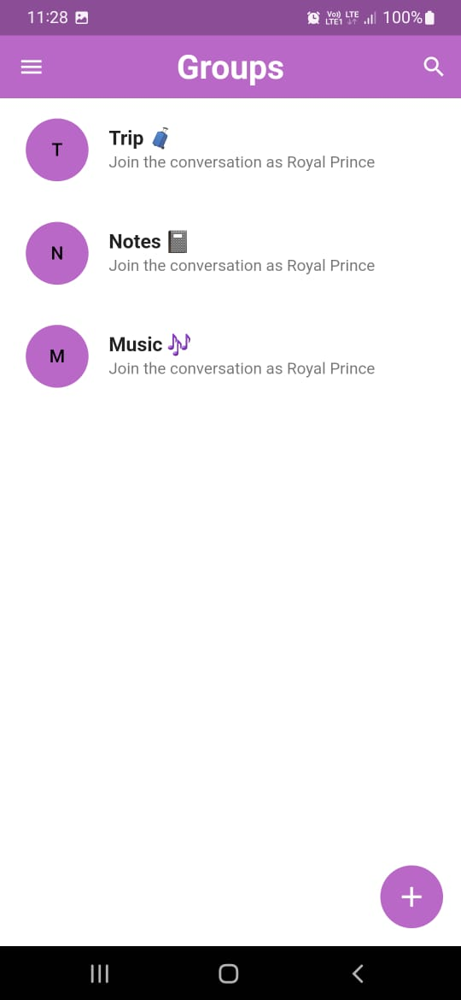
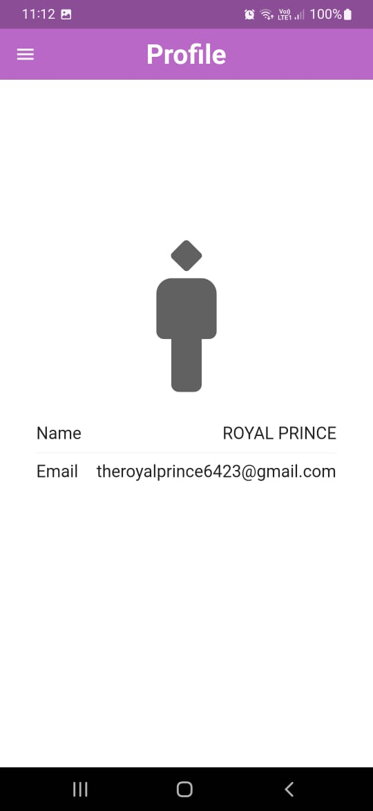
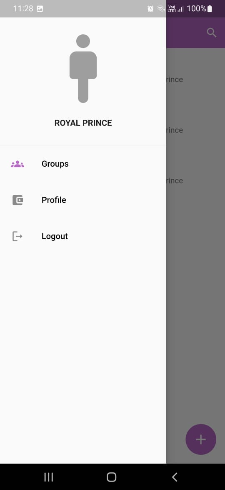

# AlChat - Your Ultimate Chat App

Welcome to AlChat, your one-stop solution for all your chatting needs! AlChat is a feature-rich chat application built using Flutter, Firebase, and Dart UI. With AlChat, you can enjoy seamless communication, join groups, edit your profile, and much more.


## Table of Contents
- [Features](#features)
- [Screenshots](#screenshots)
- [Tech Stack](#tech-stack)
- [Getting Started](#getting-started)
- [Contributing](#contributing)
- [License](#license)

## Features

AlChat comes packed with a wide range of features to enhance your chat experience:

- **Authentication**: Securely sign up and log in to your account to access all the app's features.
- **Chat**: Engage in real-time chat conversations with friends and family.
- **Groups**: Create or join groups to chat with multiple people at once.
- **Profile Editing**: Personalize your profile by adding a profile picture and updating your information.
- **Login and Logout**: Easily log in and out of your account for added security.

## Screenshots

Here are some snapshots of AlChat's sleek and user-friendly interface:

- **Login Screen**
  
  

- **Chat Interface**
  
  

- **Groups Page**
  
  

- **Profile Editing**
  
  

  - **sidebar**
  
  

## Tech Stack

AlChat leverages the following technologies to provide you with a top-notch chat experience:

- **Flutter**: A versatile UI toolkit that allows us to build natively compiled applications for mobile, web, and desktop from a single codebase.
- **Firebase**: Google's cloud-based platform provides real-time database and authentication services, ensuring seamless communication and security.
- **Dart**: The programming language used for building Flutter apps, known for its speed and flexibility.

## Getting Started

To start using AlChat on your local machine, follow these steps:

1. Clone the repository:

   ```bash
   git clone https://github.com/your-username/alchat.git
   ```

2. Navigate to the project directory:

   ```bash
   cd alchat
   ```

3. Install dependencies:

   ```bash
   flutter pub get
   ```

4. Set up Firebase:
   
   - Create a Firebase project on the [Firebase Console](https://console.firebase.google.com/).
   - Set up authentication and real-time database services.
   - Replace the Firebase configuration in the `lib/config/firebase_config.dart` file with your own.

5. Run the app:

   ```bash
   flutter run
   ```

Now you're all set to use AlChat on your local machine!

## Contributing

We welcome contributions from the community! If you'd like to enhance AlChat or fix any issues, please read our [Contribution Guidelines](CONTRIBUTING.md) and [Code of Conduct](CODE_OF_CONDUCT.md).

## License

AlChat is licensed under the [MIT License](LICENSE). Feel free to use, modify, and distribute this project as per the terms of the license.

Happy chatting with AlChat! If you have any questions or need assistance, don't hesitate to [contact us](mailto:contact@alchatapp.com).
